# Overall System Architecture

This project is built as a robust, scalable, and modular backend application primarily using NestJS. It follows a layered architecture design, promoting separation of concerns and maintainability. The system provides both traditional RESTful API endpoints and real-time communication capabilities via WebSockets, catering to various client needs, including web applications and command-line interfaces.

## 1. Core Principles

- **Modularity:** Features are organized into distinct NestJS modules (e.g., Authentication, File Management), each with its own controllers, services, and data transfer objects (DTOs).
- **Layered Architecture:** Clear separation between presentation (controllers), business logic (services), and data access (Prisma).
- **Security:** Comprehensive authentication (local and OAuth2) and authorization (role-based access control) mechanisms are built-in.
- **Type Safety:** Written entirely in TypeScript to ensure strong typing and reduce runtime errors.
- **Scalability:** Designed to be horizontally scalable, with stateless JWT authentication and a clear separation of concerns.

## 2. Technology Stack

- **Backend Framework:** NestJS (Node.js)
- **Language:** TypeScript
- **Database:** PostgreSQL (via Prisma ORM)
- **Authentication:** JWT (JSON Web Tokens), Passport.js (for local, Google OAuth2, GitHub OAuth2)
- **Real-time Communication:** Socket.IO (integrated with NestJS WebSockets)
- **File System Interaction:** Node.js `fs` module, `fs-extra` for extended operations, `ssh2` for remote file management (SFTP/SSH)
- **Validation:** `class-validator` and `class-transformer`
- **API Documentation:** Swagger (OpenAPI)
- **Logging:** `@nestjs/common` Logger (can be extended with Winston/Pino)

## 3. High-Level Architecture Diagram

```mermaid
graph TD
    A[Client Applications] -->|HTTP/WebSockets| B(NestJS Backend)
    B -->|Database Calls| C(PostgreSQL)
    B -->|External API Calls| D(OAuth Providers & Other Services)
    B -->|SSH/SFTP| E(Remote Servers)
    B -->|File System Access| F(Local Storage)
    B -->|Email Sending| G(SMTP/Mail Service)

    subgraph NestJS Backend
        B1[Controllers] <--> B2[Services]
        B2 --> B3[Prisma ORM]
        B1 --> B4[Guards/Interceptors]
        B1 -- WebSockets --> B5[Gateways]
    end

    C -- Persistence --> Data[Data Storage]
    D -- Credentials --> B

    style A fill:#222,stroke:#333,stroke-width:2px
    style B fill:#111,stroke:#333,stroke-width:2px
    style C fill:#222,stroke:#333,stroke-width:2px
    style D fill:#222,stroke:#333,stroke-width:2px
    style E fill:#111,stroke:#333,stroke-width:2px
    style F fill:#111,stroke:#333,stroke-width:2px
    style G fill:#ffc,stroke:#333,stroke-width:2px
    style B1 fill:#000,stroke:#333,stroke-width:1px
    style B2 fill:#000,stroke:#333,stroke-width:1px
    style B3 fill:#000,stroke:#333,stroke-width:1px
    style B4 fill:#000,stroke:#333,stroke-width:1px
    style B5 fill:#000,stroke:#333,stroke-width:1px
    linkStyle 0 stroke:#000,stroke-width:1px;
    linkStyle 1 stroke:#000,stroke-width:1px;
    linkStyle 2 stroke:#000,stroke-width:1px;
    linkStyle 3 stroke:#000,stroke-width:1px;
    linkStyle 4 stroke:#000,stroke-width:1px;
    linkStyle 5 stroke:#000,stroke-width:1px;
    linkStyle 6 stroke:#000,stroke-width:1px;
```

## 4. Key Modules & Data Flow

### 4.1. Authentication Module

- **Purpose:** Manages user registration, login (email/password), email verification, and OAuth2 integrations.
- **Components:**
  - `AuthController`: Handles HTTP endpoints for user authentication.
  - `AuthService`: Core business logic for user management and JWT generation.
  - `OAuthService`: Abstracts OAuth provider specifics, normalizes profiles, and links/creates user accounts with external provider IDs.
  - `JwtStrategy`, `GoogleStrategy`, `GitHubStrategy`: Passport.js strategies for token and OAuth validation.
  - `JwtAuthGuard`, `GoogleAuthGuard`, `GitHubAuthGuard`, `RolesGuard`: Protect routes and apply role-based access control.
- **Data Flow:** Clients send credentials/OAuth codes to `AuthController` -> `AuthService` handles logic, interacts with `PrismaService` for user/account data, `MailService` for verification emails, and `OAuthService` for third-party authentication -> JWT token issued and sent to client.

### 4.2. File & Folder Management Module

- **Purpose:** Provides comprehensive interaction with local and remote file systems.
- **Components:**
  - `FileController`: HTTP endpoints for local file operations (CRUD, listing, streaming, scanning).
  - `FileService`: Business logic for local file system interactions, file validation, and project scanning for AI context building.
  - `FileGateway`: WebSocket gateway for real-time file events, enabling collaborative editing features.
  - `RemoteFileController`: HTTP endpoints for remote file operations via SSH/SFTP.
  - `RemoteFileService`: Core logic for SSH/SFTP connections, remote file manipulation, and command execution.
  - `FileLanguageService`: Detects programming languages and provides formatting hints.
- **Data Flow:** Clients interact with `FileController` or `RemoteFileController` (HTTP) or `FileGateway` (WebSockets) -> Services handle operations (e.g., `FileService` for local, `RemoteFileService` for remote) -> Interact with `fs`, `ssh2`, etc. -> Responses returned to client.

## 5. Data Persistence

- **Prisma ORM:** Used as the Object-Relational Mapper to interact with PostgreSQL. It provides a type-safe and intuitive way to define database schemas and perform queries. `PrismaService` is injected into services that require database access.
- **PostgreSQL:** The primary relational database for storing user accounts, authentication details, and any structured application data.

## 6. Communication

- **RESTful APIs:** Exposed through NestJS Controllers, providing standard HTTP methods (GET, POST, PUT, DELETE) for most operations.
- **WebSockets (Socket.IO):** Used for real-time, bi-directional communication, particularly for collaborative file editing and progress updates (e.g., file downloads, scan progress).

## 7. Security Considerations

- **Authentication:** JWT for stateless API authentication, OAuth2 for secure third-party logins.
- **Authorization:** Role-Based Access Control (RBAC) enforced via `@Roles()` decorator and `RolesGuard`.
- **Input Validation:** All incoming DTOs are validated using `class-validator` to prevent common vulnerabilities like injection attacks.
- **Password Hashing:** Passwords are never stored in plain text; `bcrypt` is used for strong one-way hashing.
- **Environment Variables:** Sensitive configurations (e.g., database credentials, JWT secrets, OAuth keys) are loaded from environment variables.
- **Private Key Management:** For remote SSH/SFTP operations, private keys are expected to be securely stored on the server and accessed via configured paths.
- **CSRF Protection:** Implemented for OAuth callbacks, particularly for CLI integrations, using a `state` parameter with a CSRF token.
- **CORS:** Configured to allow specified origins for frontend and CLI interactions.

## 8. Developer Tools & Utilities

The application incorporates a suite of developer-centric tools designed to enhance productivity and streamline various development tasks. These utilities often interact directly with the underlying operating system or integrate with external tools.

- **CLI Module Scaffolding Tool:** A custom command-line interface tool that streamlines the creation of new NestJS modules, automatically generating boilerplate code (controllers, services, DTOs) and intelligently injecting user context for database models.
- **Terminal Module:** Provides interactive local shell access and persistent remote SSH sessions via WebSockets, allowing real-time command execution and output. It also offers HTTP endpoints for one-off local and remote command runs, **with command history persistence and session logging capabilities**.
- **Code Linting & Transpilation:** Integrations with ESLint and ESBuild enable on-demand code analysis, formatting, and transpilation of JavaScript/TypeScript, React, and SolidJS code.
- **File & Data Conversions:** A range of utilities for converting between different data formats (e.g., Markdown to HTML/DOCX, JSON to YAML, .env to JSON, image to SVG) and encoding/decoding operations.
- **SQL Utilities:** Tools for parsing and generating SQL statements.

These tools are typically exposed through dedicated controllers and services, leveraging Node.js's capabilities for system interaction and integrating third-party libraries for specialized tasks.
